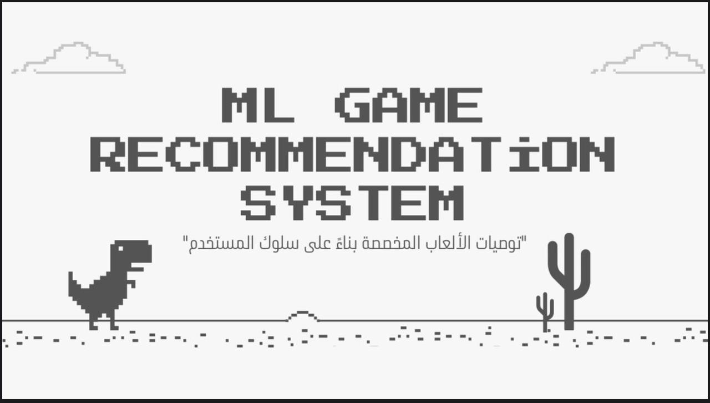
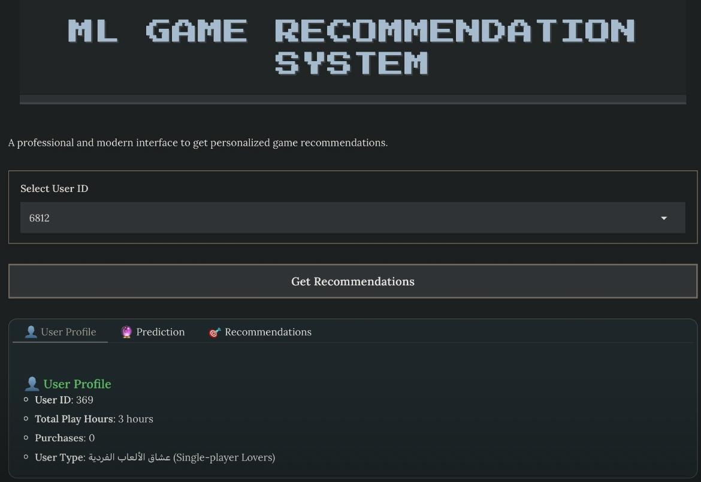
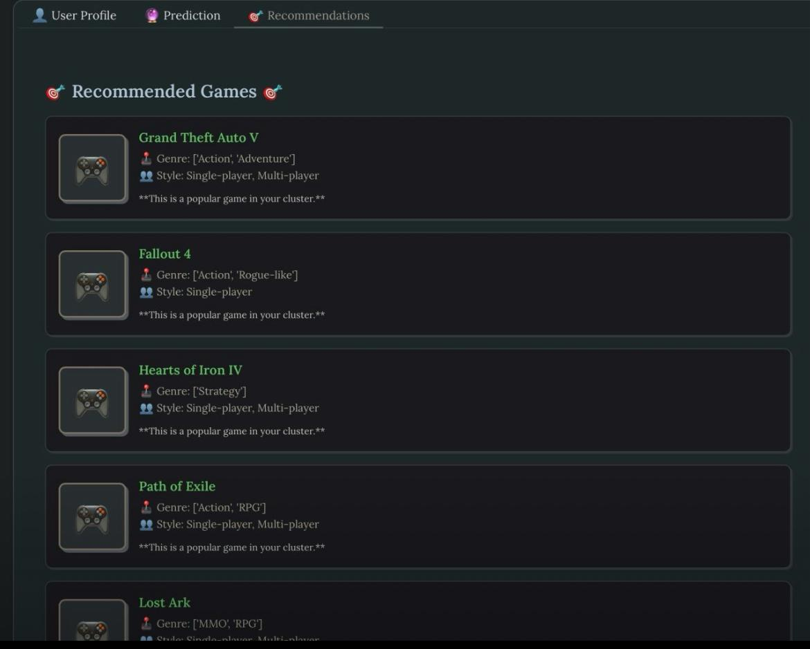

# Game Recommendation AI

> **ML GAME RECOMMENDATION SYSTEM**  

A professional and modern interface to get personalized game recommendations.

---

## Overview
This project builds an unsupervised recommendation system for video games using clustering techniques.  
It analyzes user behavior, playtime, genre diversity, and interaction patterns to group similar users and suggest relevant games.

---

## System Interface

### 👤 User Profile View

Displays user-specific stats:
- User ID
- Total Play Hours
- Purchase Count
- User Type

---

### 🎯 Recommended Games

A curated list of games based on cluster similarity:
- Game name, genre, and style
- Note: “This is a popular game in your cluster”

---

## Dataset Features
- **UserID**: Unique identifier for each user
- **GameName**: Title of the game
- **Hours**: Time spent playing
- **Behavior**: Play or Purchase
- **Categories**: Game modes (e.g., Single-player, Multi-player)
- **Genres**: Game genres (e.g., Action, Strategy)
- **is_recommended**: Boolean flag indicating user recommendation

## Workflow Summary
1. **Data Cleaning**: Handling nulls and duplicates
2. **Feature Engineering**:
   - Total playtime, purchase count, genre/category diversity
   - Purchase ratio and average playtime
3. **Encoding**:
   - One-hot encoding for top 100 games
   - Label encoding for behaviors and game names
4. **Normalization**: Standardizing numerical features
5. **Clustering**:
   - K-Means with silhouette and Davies-Bouldin scores
   - DBSCAN with noise filtering and cluster comparison
6. **Visualization**:
   - Top games by average playtime
   - Behavior distribution
   - Cluster analysis

## Notebooks
- `notebooks/Game_Recommendation_System.ipynb`: Full Colab notebook with preprocessing, feature engineering, clustering, and evaluation
## How It Works

The ML Game Recommendation System follows a modular pipeline:

1. **User Behavior Analysis**  
   - Tracks playtime, purchase history, and genre diversity  
   - Calculates metrics like average playtime and purchase ratio

2. **Feature Encoding & Normalization**  
   - One-hot encoding for top 100 games  
   - Label encoding for behaviors and game names  
   - StandardScaler for numeric features

3. **Unsupervised Clustering**  
   - K-Means and DBSCAN group users based on behavior patterns  
   - Each user is assigned to a cluster representing similar preferences

4. **Recommendation Logic**  
   - For each user, the system suggests games popular within their cluster  
   - Recommendations are filtered by genre, category, and interaction type

5. **Interface Output**  
   - User selects their ID  
   - System displays profile summary and personalized game suggestions

## 🔗 Live Demo

Try the interactive recommendation system here:

▶️ [Launch Demo](https://5d1e9c5b5d5a5d5b.gradio.live)

> This demo allows users to select their ID, view their profile, and receive personalized game recommendations based on behavioral clustering.

## Author & Contact

**Ibtisam Alghwainem**  

📬 **Contact**  
- GitHub: [github.com/ibtisamalghwainem](https://github.com/ibtisamalghwainem)  
- LinkedIn: [linkedin.com/in/ibtisamalghwainem](https://linkedin.com/in/ibtisamalghwainem)  
- Email: ibtisamalghwainem@gmail.com
